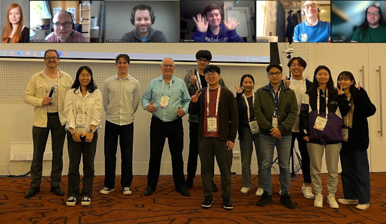

# Genetic Improvement of Software <small><em>.com</em></small>

{::options parse_block_html="true" /}

Welcome to the community website on Genetic Improvement (GI).

GI focuses on the repair and optimisation of software using computational search and evolutionary processes, often [outperforming]({{ "/learn/success" | relative_url }}) human developers at these tasks.  <small>_([read more]({{ "/learn/about" | relative_url }}))_</small>  
We as a community run a workshop and frequent [events]({{ "/events/gi" | relative_url }}) year-round, feel free to meet [us]({{ "/community/members" | relative_url }}) to discuss the future of software engineering!

{::options parse_block_html="false" /}

<figure class="figure col-12 col-sm-6 col-md-4">
  
  <figcaption class="figure-caption text-right">GI@ICSE 2023 (hybrid event)</figcaption>
</figure>

## News
* The [15th International Workshop on Genetic Improvement](events/icse2026) will take place at [ICSE 2026](https://conf.researchr.org/home/icse-2026) on April 12 2026 (Sun).
* We would like to invite researchers to submit to the special issue on Genetic Improvement in the [Automated Software Engineering Journal](https://link.springer.com/collections/fihghiidjg)

## Older News
* The [14th International Workshop on Genetic Improvement](events/icse2025) took place at [ICSE 2025](https://conf.researchr.org/home/icse-2025). Prof. Shin Hwei Tan gave the keynote talk, and Dr. Aymeric Blot presented the latest version of the Magpie tool, available at [https://github.com/bloa/magpie](https://github.com/bloa/magpie). [Recordings are available on Youtube](https://www.youtube.com/playlist?list=PLI8fiFpB7BoL5jUkvndWvSEywsu8dMdI).
* A tutorial on genetic improvement was given at [GECCO 2024](https://gecco-2024.sigevo.org/Tutorials#id_Genetic%20Improvement:%20Taking%20real-world%20source%20code%20and%20improving%20it%20using%20computational%20search%20methods) by Sandy Brownlee, Saemundur Haraldsson, John R. Woodward, and Markus Wagner.
* The [13th International Workshop on Genetic Improvement](events/icse2024) took place at [ICSE 2024](https://conf.researchr.org/home/icse-2024). Prof. Shin Yoo gave the keynote talk. [Recordings are available on Youtube](https://youtube.com/playlist?list=PLI8fiFpB7BoIRqJuY80XwmH-DFT_71y2S). Dr. Aymeric Blot presented the latest version of the Magpie tool, available at [https://github.com/bloa/magpie](https://github.com/bloa/magpie), supporting a variety of algorithms, GI operators, and parameter tuning capabilities.
* The CREST Centre at UCL is inviting attendees for 2 GI-related workshops, on Aug 3rd-4th and Sep 18th-19th. Please register for [COW64 and COW65](https://www.ucl.ac.uk/crest/crest-open-workshops).
* A tutorial on genetic improvement was given at [GECCO 2023](https://gecco-2023.sigevo.org/Tutorials#id_Genetic%20Improvement:%20Taking%20real-world%20source%20code%20and%20improving%20it%20using%20computational%20search%20methods) by Alexander Brownlee, Saemundur Haraldsson, and John Woodward.
* The [12th International Workshop on Genetic Improvement](events/icse2023) took place at [ICSE 2023](https://conf.researchr.org/home/icse-2023). Prof. Myra Cohen and Dr. Sebastian Baltes gave keynote talks.
* [The 63rd CREST Open Workshop on Genetic Improvement and Software Specialisation](https://www.ucl.ac.uk/crest/events/2023/mar/63rd-crest-open-workshop-genetic-improvement-and-software-specialisation) took place at University College London in March 2023.
* The [11th International Workshop on Genetic Improvement](events/gecco2022) took place at [GECCO 2022](https://gecco-2022.sigevo.org/), together with a [GI tutorial](https://gecco-2022.sigevo.org/Tutorials#id_Genetic%20improvement:%20Taking%20real-world%20source%20code%20and%20improving%20it%20using%20computational%20search%20methods.).
* The [10th International Workshop on Genetic Improvement](events/icse2021) took place at [ICSE 2021](https://conf.researchr.org/home/icse-2021).
* There was a [GI tutorial at ASE 2020](events/ase2020).
* There was a [tutorial on Genetic Improvement](https://ppsn2020.liacs.leidenuniv.nl/tutorials/) at PPSN 2020. [Slides can be obtained here](./slides/PPSN2020_GItutorial.pdf).
* Version 2 of the Genetic Improvement in No time (Gin) tool has been released. It is available at [https://github.com/gintool/gin](https://github.com/gintool/gin). It provides the ability to handle multi-class projects, gradle and maven build tools, built-in profiler and sampling utilities, test case generation, and a load of new edit operators.
* Version 2, alpha release, of the PYGGI Python General Framework for Genetic Improvement has been released. It is available at [https://github.com/coinse/pyggi/releases](https://github.com/coinse/pyggi/releases). This release now supports XML.
